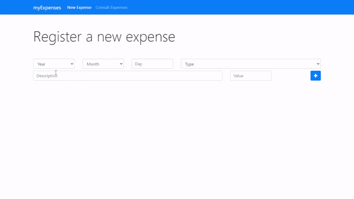

# MyExpenses - Expense Management App

 
  
  
  
  
  

## 💲 Introduction

> A simple Expense Management App built using HTML5, Bootstrap 4 and Javascript, saves in Local Storage. Totally Functional.

## 🔎 Features

> 💸 Register a new expense 👀 Consult your registered expenses 🧭 Filter by Year, Month, Day, Type and Description.

## 🛠 To-do List:

> 🖌 Re-design the page visual. 
> 📃 Create a Pagination system to expenses table.

## 👁️ Preview:

